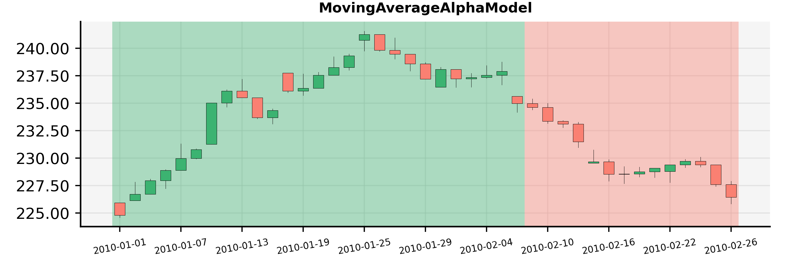

###########################################
Create an Alpha Model based strategy
###########################################

A different approach to strategies implementation involves the use of Alpha Models. The :doc:`backtesting` module contains
both an abstract AlphaModel and an AlphaModelStrategy - a base strategy, which puts together models and all settings around it.

.. note::
    Some of the concepts used in this tutorial were described in the `How to backtest your strategy`_ tutorial.
    It is strongly advised to review that one first, before learning about the Alpha models.

    .. _`How to backtest your strategy`: first_strategy_backtest.html

Simple Moving Average Alpha Model
-----------------------------------
Let's write our first Alpha Model strategy. The strategy will apply two Exponential Moving Averages of different time periods
on the recent market close prices of the traded asset to determine the suggested move. It should suggest to go LONG on this asset
if the shorter close prices moving average exceeds the longer one. Otherwise it should suggest to go SHORT. The code of
the alpha model is available in the `demo scripts`_.

.. _demo scripts: https://github.com/quarkfin/qf-lib/blob/master/demo_scripts/backtester/moving_average_alpha_model.py

At first we need to create the code of the new Alpha Model class. In order to use the AlphaModelStrategy it is necessary to
implement the AlphaModel.calculate_exposure() function, which returns the expected **Exposure**.
Exposure suggests the trend direction for managing the trading position (LONG, OUT or SHORT).

.. code-block::

    from qf_lib.backtesting.alpha_model.alpha_model import AlphaModel
    from qf_lib.backtesting.alpha_model.exposure_enum import Exposure
    from qf_lib.common.enums.price_field import PriceField
    from qf_lib.common.tickers.tickers import Ticker
    from qf_lib.data_providers.data_provider import DataProvider

    class MovingAverageAlphaModel(AlphaModel):
        def __init__(self, fast_time_period: int, slow_time_period: int,
                     risk_estimation_factor: float, data_provider: DataProvider):
            super().__init__(risk_estimation_factor, data_provider)

            self.fast_time_period = fast_time_period
            self.slow_time_period = slow_time_period

        def calculate_exposure(self, ticker: Ticker, current_exposure: Exposure) -> Exposure:
            num_of_bars_needed = self.slow_time_period
            close_tms = self.data_provider.historical_price(ticker, PriceField.Close, num_of_bars_needed)

            fast_ma = close_tms.ewm(span=self.fast_time_period, adjust=False).mean()
            slow_ma = close_tms.ewm(span=self.slow_time_period, adjust=False).mean()

            if fast_ma[-1] > slow_ma[-1]:
                return Exposure.LONG
            else:
                return Exposure.SHORT

Let's slowly review the implementation of the `calculate_exposure` function. At the very beginning we download the
historical prices from our data provider. To achieve this we use the `historical_price` function of the
`DataHandler` object. This function will return a pandas-compatible `QFSeries`.

Afterwards we apply the `ewm()` and `mean()` pandas functions to compute the fast and slow moving average. Finally,
we return either Exposure.LONG when the fast moving average > slow moving average and Exposure.SHORT otherwise.

Some of the parts still may be confusing (what is the risk_estimation_factor?), but everything will be explained in later steps.
Now let's focus on running the alpha model to see the result of the strategy.

Run Alpha Model Strategy
-----------------------------------
In order to run the strategy with the Alpha Model we just created we will need to use both `BacktestTradingSession`
and `AlphaModelStrategy`.

AlphaModelStrategy is a predefined strategy which puts together alpha models and all settings around it and generates
necessary orders. Let's create a script to run the strategy at 1:00 a.m. every day.

.. code-block::
    :caption: Run Alpha Model strategy for AAA and BBB tickers between 01/01/2010 and 01/03/2015

    import matplotlib.pyplot as plt
    plt.ion()  # required for dynamic chart

    from demo_scripts.common.utils.dummy_ticker import DummyTicker
    from demo_scripts.demo_configuration.demo_data_provider import daily_data_provider
    from demo_scripts.backtester.moving_average_alpha_model import MovingAverageAlphaModel
    from demo_scripts.demo_configuration.demo_ioc import container

    from qf_lib.backtesting.strategies.signal_generators import OnBeforeMarketOpenSignalGeneration
    from qf_lib.backtesting.strategies.alpha_model_strategy import AlphaModelStrategy
    from qf_lib.backtesting.trading_session.backtest_trading_session_builder import BacktestTradingSessionBuilder
    from qf_lib.common.enums.frequency import Frequency
    from qf_lib.common.utils.dateutils.string_to_date import str_to_date

    def main():
        start_date = str_to_date("2010-01-01")
        end_date = str_to_date("2015-03-01")

        session_builder = container.resolve(BacktestTradingSessionBuilder)
        session_builder.set_frequency(Frequency.DAILY)
        session_builder.set_data_provider(daily_data_provider)

        ts = session_builder.build(start_date, end_date)

        model = MovingAverageAlphaModel(fast_time_period=5, slow_time_period=20,
                                        risk_estimation_factor=1.25,
                                        data_provider=ts.data_handler)
        model_tickers = [DummyTicker('AAA')]
        model_tickers_dict = {model: model_tickers}

        strategy = AlphaModelStrategy(ts, model_tickers_dict)

        CalculateAndPlaceOrdersRegularEvent.set_daily_default_trigger_time()
        CalculateAndPlaceOrdersRegularEvent.exclude_weekends()
        strategy.subscribe(CalculateAndPlaceOrdersRegularEvent)

        ts.start_trading()

    if __name__ == "__main__":
        main()

That's it! Now you can run the script and monitor how well the strategy performs!

How does it actually work?
---------------------------

Alpha Model is responsible for calculating Signals, using the `calculate_exposure` function.
If you want to create your own Alpha Model, you need to remember that your class needs to extend the abstract `AlphaModel`
and therefore it should implement this function.

In our case, every day before the market opens, the Alpha Model was:

1. Computing the desired Exposure for each asset (LONG, SHORT or OUT).
2. Creating **Signals** - each Signal contains information such as suggested exposure, fraction at risk (helpful to determine the stop loss levels), signal confidence or expected price move.
3. The generated signals are further used by the **PositionSizer** in order to generate and place Orders.

Now you are probably wondering what Position Sizer did we use in the example above? By default, the Backtest Trading Session
uses `SimplePositionSizer`. This position sizer converts signals to orders which are the size of 100% of the current
portfolio value.

You can try out other position sizers to see which one will fit your needs.

.. code-block::
    :caption: Create orders of size 20% of the portfolio value

    def main():
        start_date = str_to_date("2010-01-01")
        end_date = str_to_date("2015-03-01")

        session_builder = container.resolve(BacktestTradingSessionBuilder)
        session_builder.set_frequency(Frequency.DAILY)
        session_builder.set_data_provider(daily_data_provider)
        session_builder.set_position_sizer(FixedPortfolioPercentagePositionSizer, fixed_percentage=0.2)

        ts = session_builder.build(start_date, end_date)

        model = MovingAverageAlphaModel(fast_time_period=5, slow_time_period=20,
                                        risk_estimation_factor=1.25,
                                        data_provider=ts.data_handler)
        model_tickers = [DummyTicker('AAA')]
        model_tickers_dict = {model: model_tickers}

        strategy = AlphaModelStrategy(ts, model_tickers_dict)

        CalculateAndPlaceOrdersRegularEvent.set_daily_default_trigger_time()
        CalculateAndPlaceOrdersRegularEvent.exclude_weekends()
        strategy.subscribe(CalculateAndPlaceOrdersRegularEvent)

        ts.start_trading()

.. code-block::
    :caption: Create orders sized based on the fraction_at_risk Signal value (ATR)

    def main():
        start_date = str_to_date("2010-01-01")
        end_date = str_to_date("2015-03-01")

        session_builder = container.resolve(BacktestTradingSessionBuilder)
        session_builder.set_frequency(Frequency.DAILY)
        session_builder.set_data_provider(daily_data_provider)
        session_builder.set_position_sizer(InitialRiskPositionSizer, initial_risk=0.05)

        ts = session_builder.build(start_date, end_date)

        model = MovingAverageAlphaModel(fast_time_period=5, slow_time_period=20,
                                        risk_estimation_factor=1.25,
                                        data_provider=ts.data_handler)
        model_tickers = [DummyTicker('AAA'), DummyTicker('BBB')]
        model_tickers_dict = {model: model_tickers}

        strategy = AlphaModelStrategy(ts, model_tickers_dict)

        CalculateAndPlaceOrdersRegularEvent.set_daily_default_trigger_time()
        CalculateAndPlaceOrdersRegularEvent.exclude_weekends()
        strategy.subscribe(CalculateAndPlaceOrdersRegularEvent)

        ts.start_trading()

Final thoughts
---------------------------

Alpha model can be a powerful tool to help you test your ideas and strategies. The backtest results usually provide
a full picture of what happened every day, what was the performance of the strategy etc. In case if you would need to understand
better why at certain point in time you were either LONG or SHORT, you could use a tool to plot your signals on top of a candle stick chart:

You can see here that the model was LONG for the given asset the whole January and became short around the 8th of February.
To create the document with the chart you can use the following code sample:

.. code-block::

    from demo_scripts.backtester.moving_average_alpha_model import MovingAverageAlphaModel
    from demo_scripts.common.utils.dummy_ticker import DummyTicker
    from demo_scripts.demo_configuration.demo_data_provider import daily_data_provider
    from demo_scripts.demo_configuration.demo_ioc import container
    from qf_lib.analysis.signals_analysis.signals_plotter import SignalsPlotter
    from qf_lib.backtesting.data_handler.daily_data_handler import DailyDataHandler
    from qf_lib.backtesting.events.time_event.regular_time_event.market_close_event import MarketCloseEvent
    from qf_lib.backtesting.events.time_event.regular_time_event.market_open_event import MarketOpenEvent
    from qf_lib.common.enums.frequency import Frequency
    from qf_lib.common.utils.dateutils.string_to_date import str_to_date
    from qf_lib.common.utils.dateutils.timer import SettableTimer
    from qf_lib.documents_utils.document_exporting.pdf_exporter import PDFExporter
    from qf_lib.settings import Settings

    def main():
        start_date = str_to_date("2010-01-01")
        end_date = str_to_date("2010-03-01")
        signal_frequency = Frequency.DAILY
        title = "Signals Plotter Demo"

        # set market open and close time. Does not matter much for a backtest
        # signals will be calculated at midnight for daily frequency
        MarketOpenEvent.set_trigger_time({"hour": 8, "minute": 30, "second": 0, "microsecond": 0})
        MarketCloseEvent.set_trigger_time({"hour": 13, "minute": 0, "second": 0, "microsecond": 0})

        data_handler = DailyDataHandler(daily_data_provider, SettableTimer(start_date))

        model = MovingAverageAlphaModel(fast_time_period=5, slow_time_period=20,
                                        risk_estimation_factor=1.25,
                                        data_provider=data_handler)

        pdf_exporter = container.resolve(PDFExporter)
        settings = container.resolve(Settings)

        plotter = SignalsPlotter([DummyTicker("AAA")], start_date, end_date, data_handler,
                                 model, settings, pdf_exporter, title, signal_frequency, data_frequency=signal_frequency)
        plotter.build_document()
        plotter.save()

