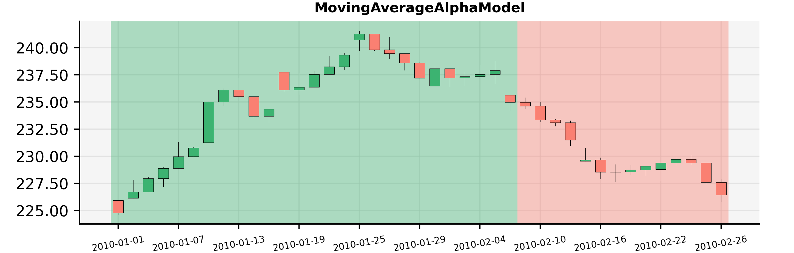

###########################################
Create an Alpha Model based strategy
###########################################

A different approach to strategies implementation involves the use of Alpha Models. The :doc:`backtesting` module contains
both an abstract AlphaModel and an AlphaModelStrategy - a base strategy, which puts together models and all settings around it.

.. note::
    Some of the concepts used in this tutorial were described in the `How to backtest your strategy`_ tutorial.
    It is strongly advised to review that one first, before learning about the Alpha models.

    .. _`How to backtest your strategy`: first_strategy_backtest.html

Alpha Model vs Abstract Strategy
---------------------------------

Both approaches run inside the same event-driven backtester, but they split work differently.

**Abstract Strategy** (see :doc:`first_strategy_backtest`) is the lower-level option. You subclass
``AbstractStrategy`` and implement ``calculate_and_place_orders()``. In that method you typically:

- fetch prices from ``ts.data_provider``,
- decide what to do,
- build orders with ``OrderFactory``,
- send them to the ``Broker``.

You control the full pipeline. That flexibility is useful when order logic is unusual (for example,
custom sizing, staged entries, or logic that does not map cleanly to a single directional view per asset).
It also means **more code and more moving parts** on your side.

**Alpha Model** is the higher-level, more **plug-and-play** option. You subclass ``AlphaModel`` and
implement only ``calculate_exposure()`` - a directional view per ticker (``LONG``, ``SHORT``, or ``OUT``).
``AlphaModelStrategy`` wires your models to the session, turns exposures into **Signals**, and lets a
**PositionSizer** convert those signals into concrete orders. You do **not** call the broker or order
factory yourself unless you extend the framework.

In short:

.. list-table::
   :header-rows: 1
   :widths: 28 36 36

   * -
     - Abstract Strategy
     - Alpha Model
   * - What you implement
     - Full ``calculate_and_place_orders()`` (data + orders + broker)
     - ``calculate_exposure()`` only (direction per ticker)
   * - Who places orders
     - You, via ``OrderFactory`` and ``Broker``
     - ``AlphaModelStrategy`` + ``PositionSizer`` (you configure parameters, no need for new implementation)
   * - Level of control
     - Boilerplate, more control
     - Plug-and-play, focus on the signal, sizing is delegated
   * - When to choose
     - You need custom execution or non-standard order flow
     - You want reusable signal logic and standardised portfolio sizing

Neither approach is “more advanced” in the sense of being harder to learn - they target different levels
of abstraction. You might prefer to use **Alpha Models for research and prototyping**, and drop down to an
**Abstract Strategy** when production execution rules do not fit the alpha-model pipeline.

Understanding Exposure
----------------------

An **Exposure** is the directional view your alpha model returns for one asset at one point in time.
QF-Lib represents it with the :class:`~qf_lib.backtesting.alpha_model.exposure_enum.Exposure` enum:

- ``Exposure.LONG`` - you want a **long** position (buy and hold the asset, or increase an existing long).
- ``Exposure.SHORT`` - you want a **short** position (profit when the price falls).
- ``Exposure.OUT`` - you want to be **flat** (no position in that asset).

In the moving-average example below, the model only answers “should we be long or short?” It does **not**
specify how many shares or what notional to trade. That is intentional: the alpha model expresses
**what** to do and the **PositionSizer** decides **how much to trade**.

For example, the default ``SimplePositionSizer`` invests **100% of portfolio value** in each signal
(fully long or fully short per asset, depending on configuration). Other sizers use a fixed percentage
of the portfolio or risk-based sizing from signal metadata (``fraction_at_risk``, and similar fields).

So returning ``Exposure.LONG`` is enough because you separate **direction** from **size**. If you need
both in one place, use an :doc:`Abstract Strategy <first_strategy_backtest>` and call
``OrderFactory.target_percent_orders()`` (or another helper) with explicit percentages yourself.

Simple Moving Average Alpha Model
-----------------------------------
Let's write our first Alpha Model strategy. The strategy will apply two Exponential Moving Averages of different time periods
on the recent market close prices of the traded asset to determine the suggested move. It should suggest to go LONG on this asset
if the shorter close prices moving average exceeds the longer one. Otherwise it should suggest to go SHORT. The code of
the alpha model is available in the `demo scripts`_.

.. _demo scripts: https://github.com/quarkfin/qf-lib/blob/master/demo_scripts/backtester/moving_average_alpha_model.py

At first we need to create the code of the new Alpha Model class. In order to use the AlphaModelStrategy it is necessary to
implement the ``AlphaModel.calculate_exposure()`` function, which returns the expected :class:`~qf_lib.backtesting.alpha_model.exposure_enum.Exposure`
for the given ticker (see `Understanding Exposure`_ above).

.. code-block:: python

    from qf_lib.backtesting.alpha_model.alpha_model import AlphaModel
    from qf_lib.backtesting.alpha_model.exposure_enum import Exposure
    from qf_lib.common.enums.price_field import PriceField
    from qf_lib.common.tickers.tickers import Ticker
    from qf_lib.data_providers.data_provider import DataProvider

    class MovingAverageAlphaModel(AlphaModel):
        def __init__(self, fast_time_period: int, slow_time_period: int,
                     risk_estimation_factor: float, data_provider: DataProvider):
            super().__init__(risk_estimation_factor, data_provider)

            self.fast_time_period = fast_time_period
            self.slow_time_period = slow_time_period

        def calculate_exposure(self, ticker: Ticker, current_exposure: Exposure) -> Exposure:
            num_of_bars_needed = self.slow_time_period
            close_tms = self.data_provider.historical_price(ticker, PriceField.Close, num_of_bars_needed)

            fast_ma = close_tms.ewm(span=self.fast_time_period, adjust=False).mean()
            slow_ma = close_tms.ewm(span=self.slow_time_period, adjust=False).mean()

            if fast_ma[-1] > slow_ma[-1]:
                return Exposure.LONG
            else:
                return Exposure.SHORT

Let's slowly review the implementation of the `calculate_exposure` function. At the very beginning we download the
historical prices from our data provider. To achieve this we use the `historical_price` function of the
``DataProvider`` (injected into the model as ``self.data_provider``). This function will return a pandas-compatible `QFSeries`.

Afterwards we apply the `ewm()` and `mean()` pandas functions to compute the fast and slow moving average. Finally,
we return either Exposure.LONG when the fast moving average > slow moving average and Exposure.SHORT otherwise.

Some of the parts still may be confusing (what is the risk_estimation_factor?), but everything will be explained in later steps.
Now let's focus on running the alpha model to see the result of the strategy.

Run Alpha Model Strategy
-----------------------------------
In order to run the strategy with the Alpha Model we just created we will need to use both `BacktestTradingSession`
and `AlphaModelStrategy`.

AlphaModelStrategy is a predefined strategy which puts together alpha models and all settings around it and generates
necessary orders. Let's create a script to run the strategy at 1:00 a.m. every day.

.. code-block:: python
    :caption: Run Alpha Model strategy for AAA ticker between 01/01/2010 and 01/03/2015

    import matplotlib.pyplot as plt
    plt.ion()  # required for dynamic chart

    from demo_scripts.common.utils.dummy_ticker import DummyTicker
    from demo_scripts.demo_configuration.demo_data_provider import daily_data_provider
    from demo_scripts.backtester.moving_average_alpha_model import MovingAverageAlphaModel
    from demo_scripts.demo_configuration.demo_settings import get_demo_settings
    from qf_lib.documents_utils.document_exporting.pdf_exporter import PDFExporter
    from qf_lib.documents_utils.excel.excel_exporter import ExcelExporter

    from qf_lib.backtesting.strategies.alpha_model_strategy import AlphaModelStrategy
    from qf_lib.backtesting.trading_session.backtest_trading_session_builder import BacktestTradingSessionBuilder
    from qf_lib.common.enums.frequency import Frequency
    from qf_lib.common.utils.dateutils.string_to_date import str_to_date

    def main():
        start_date = str_to_date("2010-01-01")
        end_date = str_to_date("2015-03-01")

        settings = get_demo_settings()
        pdf_exporter = PDFExporter(settings)
        excel_exporter = ExcelExporter(settings)

        session_builder = BacktestTradingSessionBuilder(settings, pdf_exporter, excel_exporter)
        session_builder.set_frequency(Frequency.DAILY)
        session_builder.set_data_provider(daily_data_provider)

        ts = session_builder.build(start_date, end_date)

        model = MovingAverageAlphaModel(fast_time_period=5, slow_time_period=20,
                                        risk_estimation_factor=1.25,
                                        data_provider=ts.data_provider)
        model_tickers = [DummyTicker('AAA')]
        model_tickers_dict = {model: model_tickers}

        strategy = AlphaModelStrategy(ts, model_tickers_dict)

        CalculateAndPlaceOrdersRegularEvent.set_daily_default_trigger_time()
        CalculateAndPlaceOrdersRegularEvent.exclude_weekends()
        strategy.subscribe(CalculateAndPlaceOrdersRegularEvent)

        ts.start_trading()

    if __name__ == "__main__":
        main()

That's it! Now you can run the script and monitor how well the strategy performs!

How does it actually work?
---------------------------

When ``CalculateAndPlaceOrdersRegularEvent`` fires, ``AlphaModelStrategy.calculate_and_place_orders()`` runs.
The pipeline below is handled for you; your alpha model only participates in the first step.

Pipeline::

   AlphaModel.calculate_exposure  →  Signal  →  PositionSizer.size_signals
        →  market orders (+ optional stops)  →  Broker.place_orders

**Step by step**

1. **Signals** - For each ticker, ``AlphaModel.get_signal()`` calls your ``calculate_exposure()`` and wraps the result
   in a :class:`~qf_lib.backtesting.signals.signal.Signal` (``suggested_exposure``, ``fraction_at_risk``,
   ``last_available_price``, and optional metadata). Signals are stored in the :term:`SignalsRegister` for later analysis.
2. **Sizing** - :class:`~qf_lib.backtesting.position_sizer.position_sizer.PositionSizer` maps each signal to a
   *target portfolio percentage* (or target value) and calls ``OrderFactory.target_percent_orders()`` (or
   ``target_value_orders()``).
3. **Risk controls** - If ``use_stop_losses=True`` (default on ``AlphaModelStrategy``), the sizer also creates
   :class:`~qf_lib.backtesting.order.execution_style.StopOrder` objects from ``fraction_at_risk`` and
   ``last_available_price``.
4. **Execution** - Orders pass through any configured order filters, then the broker simulates fills.

The demo above uses the session default: :class:`~qf_lib.backtesting.position_sizer.simple_position_sizer.SimplePositionSizer`.
Pick another sizer on the builder before ``build()``:

.. code-block:: python

    session_builder.set_position_sizer(FixedPortfolioPercentagePositionSizer, fixed_percentage=0.2)
    session_builder.set_position_sizer(InitialRiskPositionSizer, initial_risk=0.05)
    session_builder.set_position_sizer(InitialRiskWithVolumePositionSizer, initial_risk=0.05, max_volume_percentage=0.1)

Built-in position sizers
~~~~~~~~~~~~~~~~~~~~~~~~

.. list-table::
   :header-rows: 1
   :widths: 32 68

   * - Class
     - Role
   * - :class:`~qf_lib.backtesting.position_sizer.simple_position_sizer.SimplePositionSizer`
     - Default. Target weight = ``±100%`` of portfolio per signal (``Exposure`` value used directly).
   * - :class:`~qf_lib.backtesting.position_sizer.fixed_portfolio_percentage_position_sizer.FixedPortfolioPercentagePositionSizer`
     - Scales each signal by ``fixed_percentage`` (e.g. ``0.2`` → ±20% of portfolio per asset).
   * - :class:`~qf_lib.backtesting.position_sizer.initial_risk_position_sizer.InitialRiskPositionSizer`
     - Risk-based sizing: ``target % = initial_risk / fraction_at_risk`` (requires meaningful
       ``fraction_at_risk`` on the signal, usually from the alpha model's ATR logic).
   * - :class:`~qf_lib.backtesting.position_sizer.initial_risk_with_volume_position_sizer.InitialRiskWithVolumePositionSizer`
     - Same risk formula as ``InitialRiskPositionSizer``, then caps notional using recent average volume.

See the :doc:`backtesting` API reference (``position_sizer`` section) for parameters and sizing examples in each class docstring.

Final thoughts
---------------------------

Alpha model can be a powerful tool to help you test your ideas and strategies. The backtest results usually provide
a full picture of what happened every day, what was the performance of the strategy etc. In case if you would need to understand
better why at certain point in time you were either LONG or SHORT, you could use a tool to plot your signals on top of a candle stick chart:

You can see here that the model was LONG for the given asset the whole January and became short around the 8th of February.
To create the document with the chart you can use the following code sample:

.. code-block:: python

    from demo_scripts.backtester.moving_average_alpha_model import MovingAverageAlphaModel
    from demo_scripts.common.utils.dummy_ticker import DummyTicker
    from demo_scripts.demo_configuration.demo_data_provider import daily_data_provider
    from demo_scripts.demo_configuration.demo_settings import get_demo_settings
    from qf_lib.documents_utils.document_exporting.pdf_exporter import PDFExporter
    from qf_lib.analysis.signals_analysis.signals_plotter import SignalsPlotter
    from qf_lib.backtesting.events.time_event.regular_time_event.market_close_event import MarketCloseEvent
    from qf_lib.backtesting.events.time_event.regular_time_event.market_open_event import MarketOpenEvent
    from qf_lib.common.enums.frequency import Frequency
    from qf_lib.common.utils.dateutils.string_to_date import str_to_date
    from qf_lib.common.utils.dateutils.timer import SettableTimer
    from qf_lib.documents_utils.document_exporting.pdf_exporter import PDFExporter
    from qf_lib.settings import Settings

    def main():
        start_date = str_to_date("2010-01-01")
        end_date = str_to_date("2010-03-01")
        signal_frequency = Frequency.DAILY
        title = "Signals Plotter Demo"

        # set market open and close time. Does not matter much for a backtest
        # signals will be calculated at midnight for daily frequency
        MarketOpenEvent.set_trigger_time({"hour": 8, "minute": 30, "second": 0, "microsecond": 0})
        MarketCloseEvent.set_trigger_time({"hour": 13, "minute": 0, "second": 0, "microsecond": 0})

        daily_data_provider.set_timer(SettableTimer(start_date))

        model = MovingAverageAlphaModel(fast_time_period=5, slow_time_period=20,
                                        risk_estimation_factor=1.25,
                                        data_provider=daily_data_provider)
        settings = get_demo_settings()
        pdf_exporter = PDFExporter(settings)

        plotter = SignalsPlotter([DummyTicker("AAA")], start_date, end_date, daily_data_provider,
                                 model, settings, pdf_exporter, title, signal_frequency, data_frequency=signal_frequency)
        plotter.build_document()
        plotter.save()

