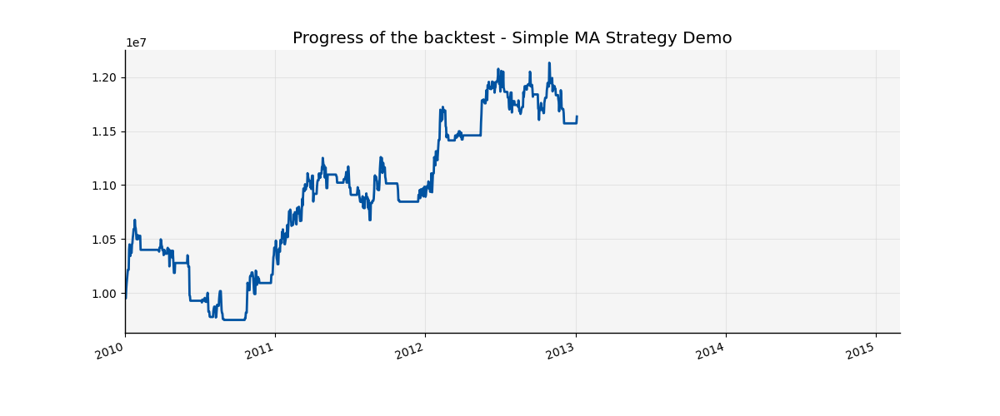

###########################################
How to backtest your strategy
###########################################

This document will guide you through the process of implementing and backtesting an investment strategy. Afterwards you will be able to:

* run a backtest of your own strategy in python,
* view the historical performance of your strategy (and various related measures like Sharpe Ratio or Max Drawdown),

All the used code samples can be found in the `demo scripts`_ directory of the qf-lib project.

.. _demo scripts: https://github.com/quarkfin/qf-lib/tree/master/demo_scripts

.. note::
    This demo uses dummy data, generated just for the purpose of this tutorial, which can be found in the
    `demo_data_provider`_.  The data is saved in a CSV file, with each line containing the ticker name and prices
    (open, high, low, close and volume).

    .. _demo_data_provider: https://github.com/quarkfin/qf-lib/blob/master/demo_scripts/demo_configuration/demo_data_provider.py

In order to implement and afterwards backtest a strategy, the following steps are needed:

1. Create a `BacktestTradingSession`
2. Create your own `Strategy`
3. Schedule the strategy execution
4. Start the backtest by calling `start_trading()` method on the `TradingSession`

**********************************
Create a simple trading session
**********************************

Backtest Trading Session contains the full configuration of all elements, connections and dependencies, which belong to your
trading environment. It contains parameters like backtest frequency, data provider and also more complicated elements like
commission or slippage model. To make the configuration easier we use the preconfigured `container`_ and `BacktestTradingSessionBuilder`.

.. code-block::
    :caption: Backtest a daily strategy for ticker AAA between 01/01/2010 and 01/03/2015

    def main():
        ticker = DummyTicker("AAA")
        start_date = str_to_date("2010-01-01")
        end_date = str_to_date("2015-03-01")

        session_builder = container.resolve(BacktestTradingSessionBuilder)
        session_builder.set_frequency(Frequency.DAILY)
        session_builder.set_data_provider(daily_data_provider)

        ts = session_builder.build(start_date, end_date)

.. code-block::
    :caption: Backtest an intraday strategy for ticker AAA between 01/07/2019 and 08/31/2019

    def main():
        ticker = DummyTicker("AAA")
        start_date = str_to_date("2019-07-01")
        end_date = str_to_date("2019-08-31")

        session_builder = container.resolve(BacktestTradingSessionBuilder)
        session_builder.set_frequency(Frequency.MIN_1)
        session_builder.set_data_provider(intraday_data_provider)
        session_builder.set_market_open_and_close_time(
            {"hour": 0, "minute": 0}, {"hour": 23, "minute": 59})

        ts = session_builder.build(start_date, end_date)

.. _container: https://github.com/quarkfin/qf-lib/blob/master/demo_scripts/demo_configuration/demo_ioc.py

**********************************
Create Moving Average strategy
**********************************

Now, after we configured the necessary dependencies, we can finally go to the next, more interesting step, which is the strategy
implementation. The first strategy we will implement will be a **simple moving average strategy**. We will compute two moving averages -
long moving average (20 bars) and a short moving average (5 bars), and we will create a **BUY order in case if the short moving average
is greater or equal to the long moving average**. Otherwise - we will remove any remaining assets in our portfolio and will not make any new orders.

All the next steps will use various utility classes (`DataHandler`, `OrderFactory` and `BacktestBroker`), created
automatically inside the `BacktestTradingSession`.

Download historical prices
==========================

At first, we will need to download the historical prices from our data provider. To achieve this we can
use the `historical_price` function of the  `DataHandler` objects. This function will return a pandas-compatible `QFSeries`.

.. code-block::
    :caption: Return latest 10 Close prices of AAA

    series = self.data_handler.historical_price(DummyTicker("AAA"), PriceField.Close, 10)

Create orders
===============

In order to create necessary orders we will use the `target_percent_orders` function of the `OrderFactory` object.
This function takes a dictionary, which maps tickers onto desired percentages of your portfolio. For example, if you would like to invest 75% of your portfolio
into ticker AAA you can use the following function:

.. code::

    self.order_factory.target_percent_orders({DummyTicker("AAA"): 0.75}, MarketOrder(), TimeInForce.DAY)

In case if your portfolio currently does not hold this asset, it will create a Market Order, with time in force = DAY.
In case if 75% of your portfolio is already invested into AAA, no order will be created.

.. note::
    By default the quantity of an order is an integer. In case if your portfolio cash equals 1,000,000, and you would like to invest
    its 50% into an asset with price = 132, then the order created will aim at buying 3,787 contracts (3,787 x 132 = 499,884). Fractional
    contracts are supported only for tickers of SecurityType `CRYPTO`.

Place orders
===============

Finally, we will yse the `Broker` object to cancel any existing, not filled orders and place the newly created ones.

.. code-block::

    self.broker.cancel_all_open_orders()
    self.broker.place_orders(orders)

Create strategy
===================

Finally, we can start writing the code of our strategy! The only requirement is that the our strategy class extends the `AbstractStrategy`,
which means that at least it should implement the `calculate_and_place_orders` function. Everything, that we described (downloading the data, computing the moving averages, creating and placing the orders), should happen inside this function. As we will see later, this function
is used by the Backtest Trading Session to execute our trading strategy, so it's important that all the logic is encapsulated within it.

.. code-block::

    class SimpleMAStrategy(AbstractStrategy):
        """
        strategy, which computes every day, before the market open time, two simple moving averages
        (long - 20 days, short - 5 days) and creates a buy order in case if the short moving average
        is greater or equal to the long moving average.
        """
        def __init__(self, ts: BacktestTradingSession, ticker: Ticker):
            super().__init__(ts)
            self.broker = ts.broker
            self.order_factory = ts.order_factory
            self.data_handler = ts.data_handler
            self.ticker = ticker

        def calculate_and_place_orders(self):
            # Compute the moving averages
            long_ma_len = 20
            short_ma_len = 5

            # Use data handler to download last 20 daily close prices and use them to compute the moving averages
            long_ma_series = self.data_handler.historical_price(self.ticker, PriceField.Close, long_ma_len)
            long_ma_price = long_ma_series.mean()

            short_ma_series = long_ma_series.tail(short_ma_len)
            short_ma_price = short_ma_series.mean()

            if short_ma_price >= long_ma_price:
                # Place a buy Market Order, adjusting the position to a value equal to 100% of the portfolio
                orders = self.order_factory.target_percent_orders({self.ticker: 1.0},
                    MarketOrder(), TimeInForce.DAY)
            else:
                orders = self.order_factory.target_percent_orders({self.ticker: 0.0},
                    MarketOrder(), TimeInForce.DAY)

            # Cancel any open orders and place the newly created ones
            self.broker.cancel_all_open_orders()
            self.broker.place_orders(orders)

**********************************
Schedule strategy execution
**********************************

At this point, what is left is subscribing our strategy to a certain event (e.g. `CalculateAndPlaceOrdersRegularEventt` etc).
Every time this event will occur, the `calculate_and_place_orders` of our strategy will be invoked.

In our demo  we will use a predefined signal generation event  - `CalculateAndPlaceOrdersRegularEvent`. The default time of the
`CalculateAndPlaceOrdersRegularEvent` is defined as 01:00 a.m. For a daily backtest, the exact hours
are not important, so we can leave the default value.

After the creation of a strategy object, in order to proceed with the signal generation and orders placement
every day at the `CalculateAndPlaceOrdersRegularEvent` event time, we will need to subscribe the strategy to the event
in the following way:

.. code::

    strategy = ExampleStrategy(trading_session)
    CalculateAndPlaceOrdersRegularEvent.set_daily_default_trigger_time()
    CalculateAndPlaceOrdersRegularEvent.exclude_weekends()
    strategy.subscribe(CalculateAndPlaceOrdersRegularEvent)

If we will add these two lines into our script, every day - at the chosen time (1 a.m. in our case) - we will compute
and place market orders for the AAA ticker.

**********************************
Let's start the backtest!
**********************************

After finishing all the necessary configuration we can finally put all the above lines together and run the backtest by calling
the `start_trading()` on the Backtest Trading Session!

.. code-block::

    import matplotlib.pyplot as plt

    from qf_lib.backtesting.events.time_event.regular_time_event.calculate_and_place_orders_event import \
        CalculateAndPlaceOrdersRegularEvent
    from qf_lib.backtesting.strategies.abstract_strategy import AbstractStrategy

    plt.ion()  # required for dynamic chart, good to keep this at the beginning of imports

    from demo_scripts.common.utils.dummy_ticker import DummyTicker
    from demo_scripts.demo_configuration.demo_data_provider import daily_data_provider
    from demo_scripts.demo_configuration.demo_ioc import container
    from qf_lib.backtesting.order.execution_style import MarketOrder
    from qf_lib.backtesting.order.time_in_force import TimeInForce
    from qf_lib.backtesting.trading_session.backtest_trading_session import BacktestTradingSession
    from qf_lib.backtesting.trading_session.backtest_trading_session_builder import BacktestTradingSessionBuilder
    from qf_lib.common.enums.frequency import Frequency
    from qf_lib.common.enums.price_field import PriceField
    from qf_lib.common.tickers.tickers import Ticker
    from qf_lib.common.utils.dateutils.string_to_date import str_to_date

    class SimpleMAStrategy(AbstractStrategy):
        """
        strategy, which computes every day, before the market open time, two simple moving averages
        (long - 20 days, short - 5 days) and creates a buy order in case if the short moving average
        is greater or equal to the long moving average.
        """
        def __init__(self, ts: BacktestTradingSession, ticker: Ticker):
            super().__init__(ts)
            self.broker = ts.broker
            self.order_factory = ts.order_factory
            self.data_handler = ts.data_handler
            self.ticker = ticker

        def calculate_and_place_orders(self):
            # Compute the moving averages
            long_ma_len = 20
            short_ma_len = 5

            # Use data handler to download last 20 daily close prices and use them to compute the moving averages
            long_ma_series = self.data_handler.historical_price(self.ticker, PriceField.Close, long_ma_len)
            long_ma_price = long_ma_series.mean()

            short_ma_series = long_ma_series.tail(short_ma_len)
            short_ma_price = short_ma_series.mean()

            if short_ma_price >= long_ma_price:
                # Place a buy Market Order, adjusting the position to a value equal to 100% of the portfolio
                orders = self.order_factory.target_percent_orders({self.ticker: 1.0},
                    MarketOrder(), TimeInForce.DAY)
            else:
                orders = self.order_factory.target_percent_orders({self.ticker: 0.0},
                    MarketOrder(), TimeInForce.DAY)

            # Cancel any open orders and place the newly created ones
            self.broker.cancel_all_open_orders()
            self.broker.place_orders(orders)

    def main():
        # settings
        backtest_name = 'Simple MA Strategy Demo'
        start_date = str_to_date("2010-01-01")
        end_date = str_to_date("2015-03-01")
        ticker = DummyTicker("AAA")

        # configuration
        session_builder = container.resolve(BacktestTradingSessionBuilder)
        session_builder.set_frequency(Frequency.DAILY)
        session_builder.set_backtest_name(backtest_name)
        session_builder.set_data_provider(daily_data_provider)

        ts = session_builder.build(start_date, end_date)

        strategy = SimpleMAStrategy(ts, ticker)
        CalculateAndPlaceOrdersRegularEvent.set_daily_default_trigger_time()
        CalculateAndPlaceOrdersRegularEvent.exclude_weekends()
        strategy.subscribe(CalculateAndPlaceOrdersRegularEvent)

        ts.start_trading()

**********************************
I run the backtest. What now?
**********************************

If you used the above linked code, along with all the imports, you should have been able to see a dynamic chart,
presenting the performance of your strategy:

Additionally, you should be able to see the following output in the console, after your backtest finishes:

.. code::

                             Simple MA Strategy Demo
    Start Date                         2010-01-02
    End Date                           2015-03-01
    Total Return                            20.69 %
    Annualised Return                        3.71 %
    Annualised Volatility                    5.91 %
    Annualised Upside Vol.                   6.04 %
    Annualised Downside Vol.                 5.85 %
    Sharpe Ratio                             0.62
    Omega Ratio                              1.12
    Calmar Ratio                             0.43
    Gain to Pain Ratio                       0.53
    Sorino Ratio                             0.63
    5% CVaR                                 -0.94 %
    Annualised 5% CVaR                     -13.89 %
    Max Drawdown                             8.70 %
    Avg Drawdown                             3.59 %
    Avg Drawdown Duration                   69.85 days
    Best Return                              2.18 %
    Worst Return                            -2.61 %
    Avg Positive Return                      0.47 %
    Avg Negative Return                     -0.43 %
    Skewness                                 0.13
    No. of daily samples                     1885

Probably now you're wondering where to find more details regarding the performance of your strategy. If you didn't change
the `demo_settings.json`, you should be able to find `output/backtesting` directory in the root of your project.
Inside you will find a directory for each backtest you run, with the backtest name and date of its execution.
By default, after the backtest execution you should be able to access the following files:

* Transactions - CSV file containing a list of all fills that were created within your backtests
* Config - YAML file containing all configuration details, which you have added to the backtest trading session
* Portfolio Analysis Sheet  - document with many details related to the performance of assets, number and concertation of assets in the portfolio over time etc.
* Tearsheet - summary of the whole backtest
* Timeseries - timeseries of your portfolio
* Trades Analysis Sheet - trade related details (e.g. number of long / short trades, avergare trade duration, average trade return, best trade return etc)

