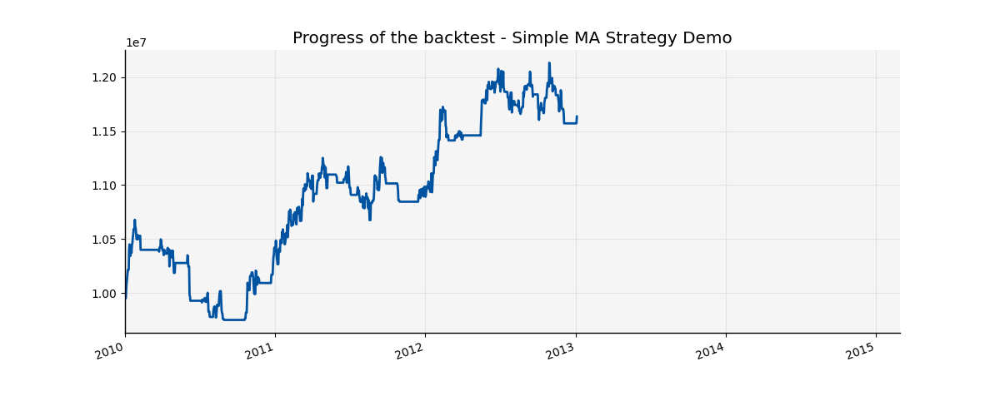

########################################
Plotting and Visualization
########################################

QF-Lib contains a full charting library built on top of Matplotlib. All charts follow the same
*decorator* pattern:

1. Create a **chart** object (``LineChart``, ``BarChart``, ``HeatMapChart``, etc.).
2. Add **decorators** that add data series, legends, titles, axis labels, etc.
3. Call ``.plot()`` to render and ``plt.show(block=True)`` to display interactively
   (or ``plt.savefig(...)`` to export to a file).

All code samples in this tutorial use the demo data provider and can be run directly from
``demo_scripts/charts/``.

*******************************************************
LineChart - the universal chart
*******************************************************

:class:`~qf_lib.plotting.charts.line_chart.LineChart` is the most versatile chart. It renders one or
more time series as continuous lines.

Basic line chart
================
.. code-block:: python

    import matplotlib.pyplot as plt

    from qf_lib.common.enums.price_field import PriceField
    from qf_lib.common.enums.matplotlib_location import Location
    from qf_lib.common.utils.dateutils.string_to_date import str_to_date
    from qf_lib.plotting.charts.line_chart import LineChart
    from qf_lib.plotting.decorators.data_element_decorator import DataElementDecorator
    from qf_lib.plotting.decorators.legend_decorator import LegendDecorator
    from qf_lib.plotting.decorators.title_decorator import TitleDecorator
    from qf_lib.plotting.decorators.axes_label_decorator import AxesLabelDecorator

    from demo_scripts.common.utils.dummy_ticker import DummyTicker
    from demo_scripts.demo_configuration.demo_data_provider import daily_data_provider

    prices = daily_data_provider.get_price(
        DummyTicker('AAA'), PriceField.Close,
        str_to_date('2010-01-01'), str_to_date('2018-12-31'),
    )

    chart = LineChart()

    # DataElementDecorator wraps a QFSeries and renders it as a line
    data = DataElementDecorator(prices)
    chart.add_decorator(data)

    # Title
    chart.add_decorator(TitleDecorator("AAA Close Price"))

    # Axis labels
    chart.add_decorator(AxesLabelDecorator(x_label="Date", y_label="Price"))

    # Legend
    legend = LegendDecorator(legend_placement=Location.BEST, key='legend')
    legend.add_entry(data, "AAA")
    chart.add_decorator(legend)

    chart.plot()
    plt.show(block=True)

Plotting multiple series on one chart
=======================================
.. code-block:: python
    import matplotlib.pyplot as plt

    from qf_lib.common.enums.price_field import PriceField
    from qf_lib.common.utils.dateutils.string_to_date import str_to_date
    from qf_lib.plotting.charts.line_chart import LineChart
    from qf_lib.plotting.decorators.data_element_decorator import DataElementDecorator
    from qf_lib.plotting.decorators.legend_decorator import LegendDecorator

    from demo_scripts.demo_configuration.demo_data_provider import daily_data_provider
    from demo_scripts.common.utils.dummy_ticker import DummyTicker

    tickers = [DummyTicker('AAA'), DummyTicker('BBB'), DummyTicker('CCC')]
    prices_df = daily_data_provider.get_price(
        tickers, PriceField.Close,
        str_to_date('2010-01-01'), str_to_date('2018-12-31'),
    )

    chart = LineChart()
    legend = LegendDecorator(key='legend')

    for ticker in tickers:
        series = prices_df[ticker]
        elem = DataElementDecorator(series)
        chart.add_decorator(elem)
        legend.add_entry(elem, ticker.as_string())

    chart.add_decorator(legend)
    chart.plot()
    plt.show(block=True)

Adding a cone (confidence band)
=================================
:class:`~qf_lib.plotting.decorators.cone_decorator.ConeDecorator` adds a shaded cone around
a historical series to project its out-of-sample range:

.. code-block:: python

    import matplotlib.pyplot as plt

    from qf_lib.common.enums.price_field import PriceField
    from qf_lib.common.utils.dateutils.string_to_date import str_to_date
    from qf_lib.plotting.charts.line_chart import LineChart
    from qf_lib.plotting.decorators.data_element_decorator import DataElementDecorator
    from qf_lib.plotting.decorators.cone_decorator import ConeDecorator

    from demo_scripts.demo_configuration.demo_data_provider import daily_data_provider
    from demo_scripts.common.utils.dummy_ticker import DummyTicker

    prices = daily_data_provider.get_price(
        DummyTicker('AAA'), PriceField.Close,
        str_to_date('2010-01-01'), str_to_date('2018-12-31'),
    )

    live_start_date = str_to_date('2016-01-01')

    chart = LineChart()
    data = DataElementDecorator(prices)
    cone = ConeDecorator(live_start_date=live_start_date, series=prices, key='cone')

    chart.add_decorator(data)
    chart.add_decorator(cone)
    chart.plot()
    plt.show(block=True)

Referencing image from the demo:

*******************************************************
BarChart
*******************************************************

:class:`~qf_lib.plotting.charts.bar_chart.BarChart` renders categorical bar charts -
useful for visualising returns per period or comparing assets.

.. code-block:: python

    import datetime
    import matplotlib.pyplot as plt
    from demo_scripts.common.utils.dummy_ticker import DummyTicker
    from demo_scripts.demo_configuration.demo_data_provider import daily_data_provider

    from qf_lib.common.enums.orientation import Orientation
    from qf_lib.common.enums.price_field import PriceField
    from qf_lib.common.utils.dateutils.string_to_date import str_to_date
    from qf_lib.containers.series.qf_series import QFSeries
    from qf_lib.plotting.charts.bar_chart import BarChart
    from qf_lib.plotting.decorators.data_element_decorator import DataElementDecorator
    from qf_lib.plotting.decorators.legend_decorator import LegendDecorator
    from qf_lib.plotting.decorators.title_decorator import TitleDecorator
    from qf_lib.plotting.decorators.axes_label_decorator import AxesLabelDecorator

    start = str_to_date('2018-01-01')
    end = str_to_date('2018-01-31')

    tickers = [DummyTicker('AAA'), DummyTicker('BBB'), DummyTicker('CCC')]
    df = daily_data_provider.get_price(tickers, PriceField.Close, start, end)

    chart = BarChart(
        orientation=Orientation.Vertical,
        stacked=False,
        start_x=start - datetime.timedelta(days=1),
        end_x=end + datetime.timedelta(days=1),
    )
    chart.add_decorator(TitleDecorator("Daily Close Prices - January 2018"))
    chart.add_decorator(AxesLabelDecorator(x_label='Date', y_label='Price'))

    legend = LegendDecorator()
    for ticker in tickers:
        series = QFSeries(df[ticker])
        elem = DataElementDecorator(series)
        chart.add_decorator(elem)
        legend.add_entry(elem, ticker.as_string())

    chart.add_decorator(legend)
    chart.plot()
    plt.show(block=True)

Annual returns bar chart helper
=================================
The ``create_returns_bar_chart`` helper produces a ready-made annual-returns bar chart from a price
series in a single call:

.. code-block:: python

    import matplotlib.pyplot as plt
    from demo_scripts.common.utils.dummy_ticker import DummyTicker
    from demo_scripts.demo_configuration.demo_data_provider import daily_data_provider

    from qf_lib.common.enums.price_field import PriceField
    from qf_lib.common.utils.dateutils.string_to_date import str_to_date

    from qf_lib.plotting.helpers.create_returns_bar_chart import create_returns_bar_chart

    prices = daily_data_provider.get_price(
        DummyTicker('AAA'), PriceField.Close,
        str_to_date('2006-01-01'), str_to_date('2016-12-31'),
    )

    chart = create_returns_bar_chart(prices)
    chart.plot()
    plt.show(block=True)

*******************************************************
HeatMapChart
*******************************************************

:class:`~qf_lib.plotting.charts.heatmap_chart.HeatMapChart` visualises a matrix (e.g. a correlation
or return matrix) as a colour-coded grid.

.. code-block:: python

    import matplotlib.pyplot as plt
    from demo_scripts.common.utils.dummy_ticker import DummyTicker
    from demo_scripts.demo_configuration.demo_data_provider import daily_data_provider

    from qf_lib.common.enums.axis import Axis
    from qf_lib.common.enums.price_field import PriceField
    from qf_lib.common.utils.dateutils.string_to_date import str_to_date
    from qf_lib.containers.dataframe.qf_dataframe import QFDataFrame
    from qf_lib.plotting.charts.heatmap_chart import HeatMapChart
    from qf_lib.plotting.decorators.axis_tick_labels_decorator import AxisTickLabelsDecorator

    # Build a correlation matrix from demo price data
    tickers = [DummyTicker('AAA'), DummyTicker('BBB'), DummyTicker('CCC'), DummyTicker('DDD')]
    prices_df = daily_data_provider.get_price(
        tickers, PriceField.Close,
        str_to_date('2010-01-01'), str_to_date('2018-12-31'),
    )
    corr = prices_df.to_simple_returns().corr()

    asset_names = [t.as_string() for t in tickers]

    chart = HeatMapChart(
        data=QFDataFrame(corr.values, index=corr.index, columns=corr.columns),
        min_value=-1.0,
        max_value=1.0,
        annotations=True,  # print the numeric value in each cell
        cbar=True,  # show the colour bar on the right
    )
    chart.add_decorator(AxisTickLabelsDecorator(labels=asset_names, axis=Axis.X, rotation='auto'))
    chart.add_decorator(AxisTickLabelsDecorator(labels=list(reversed(asset_names)), axis=Axis.Y))

    chart.plot()
    plt.show(block=True)

*******************************************************
ConeChart
*******************************************************

:class:`~qf_lib.plotting.charts.cone_chart.ConeChart` computes the in-sample volatility cone
(percentile bands) and extends them into the future or into an out-of-sample period:

.. code-block:: python

    import matplotlib.pyplot as plt
    from demo_scripts.common.utils.dummy_ticker import DummyTicker
    from demo_scripts.demo_configuration.demo_data_provider import daily_data_provider

    from qf_lib.common.enums.price_field import PriceField
    from qf_lib.common.utils.dateutils.string_to_date import str_to_date

    from qf_lib.plotting.charts.cone_chart import ConeChart

    prices = daily_data_provider.get_price(
        DummyTicker('AAA'), PriceField.Close,
        str_to_date('2006-01-01'), str_to_date('2018-12-31'),
    )

    live_start_date = str_to_date('2016-01-01')

    cone_chart = ConeChart(
        data=prices,
        nr_of_data_points=200,  # in-sample period used to estimate the cone
        is_end_date=live_start_date,
    )
    cone_chart.plot()
    plt.show(block=True)

*******************************************************
Return quantiles chart
*******************************************************

The :func:`~qf_lib.plotting.helpers.create_return_quantiles.create_return_quantiles` helper shows
quarterly return distributions split into in-sample and out-of-sample periods:

.. code-block:: python

    from demo_scripts.common.utils.dummy_ticker import DummyTicker
    from demo_scripts.demo_configuration.demo_data_provider import daily_data_provider
    from matplotlib import pyplot as plt
    from qf_lib.common.enums.price_field import PriceField
    from qf_lib.common.utils.dateutils.string_to_date import str_to_date
    from qf_lib.plotting.helpers.create_return_quantiles import create_return_quantiles

    prices = daily_data_provider.get_price(
        DummyTicker('AAA'), PriceField.Close,
        str_to_date('2012-01-01'), str_to_date('2018-12-31'),
    )
    live_start_date = str_to_date('2016-01-01')

    chart = create_return_quantiles(prices, live_start_date)
    chart.plot()
    plt.show(block=True)

*******************************************************
Available decorators
*******************************************************

Decorators add visual or data elements to any chart. They are applied with
``chart.add_decorator(decorator_instance)``.

.. list-table::
   :header-rows: 1
   :widths: 40 60

   * - Decorator class
     - Effect
   * - :class:`~qf_lib.plotting.decorators.data_element_decorator.DataElementDecorator`
     - Adds a data series (line or bars) to the chart.
   * - :class:`~qf_lib.plotting.decorators.title_decorator.TitleDecorator`
     - Sets the chart title.
   * - :class:`~qf_lib.plotting.decorators.legend_decorator.LegendDecorator`
     - Adds a legend. Use ``legend.add_entry(data_elem, label)`` to label each series.
   * - :class:`~qf_lib.plotting.decorators.axes_label_decorator.AxesLabelDecorator`
     - Sets x-axis and y-axis labels.
   * - :class:`~qf_lib.plotting.decorators.axis_tick_labels_decorator.AxisTickLabelsDecorator`
     - Customises the tick labels on an axis (e.g. rotation, custom strings).
   * - :class:`~qf_lib.plotting.decorators.cone_decorator.ConeDecorator`
     - Adds a shaded volatility cone to a ``LineChart``.
   * - :class:`~qf_lib.plotting.decorators.horizontal_line_decorator.HorizontalLineDecorator`
     - Draws a horizontal reference line.
   * - :class:`~qf_lib.plotting.decorators.vertical_span_decorator.VerticalSpanDecorator`
     - Adds a shaded vertical band (e.g. to highlight a drawdown period).
   * - :class:`~qf_lib.plotting.decorators.text_decorator.TextDecorator`
     - Places arbitrary text anywhere on the chart.
   * - :class:`~qf_lib.plotting.decorators.stem_decorator.StemDecorator`
     - Adds a stem plot overlay (vertical lines from a baseline).
   * - :class:`~qf_lib.plotting.decorators.scatter_decorator.ScatterDecorator`
     - Adds a scatter plot layer.
   * - :class:`~qf_lib.plotting.decorators.top_drawdown_decorator.TopDrawdownDecorator`
     - Highlights the N largest drawdown periods on a line chart.

*******************************************************
Helper functions (one-liners)
*******************************************************

The ``qf_lib.plotting.helpers`` subpackage provides ready-made chart builders for common visualisations.
Each returns a fully configured chart object that you only need to call ``.plot()`` on.

.. list-table::
   :header-rows: 1
   :widths: 55 45

   * - Helper
     - Chart produced
   * - ``create_line_chart(series_list)``
     - Multi-series line chart.
   * - ``create_bar_chart(series)``
     - Bar chart from a QFSeries.
   * - ``create_returns_bar_chart(series)``
     - Annual returns bar chart.
   * - ``create_return_quantiles(series, live_start_date)``
     - Quarterly return quantile chart, in-sample vs OOS.
   * - ``create_returns_similarity(series_1, series_2)``
     - Return similarity / rolling correlation chart.
   * - ``create_skewness_chart(series)``
     - Rolling skewness of returns.
   * - ``create_qq_chart(series)``
     - QQ-plot against a normal distribution.
   * - ``create_rolling_chart(series, func, window)``
     - Rolling application of any function.
   * - ``create_dd_probability_chart(series)``
     - Drawdown probability distribution.

*******************************************************
Saving charts to file
*******************************************************

After calling ``chart.plot()`` use standard Matplotlib:

.. code-block:: python

    import matplotlib.pyplot as plt

    chart.plot()
    plt.savefig("my_chart.png", dpi=150, bbox_inches='tight')
    plt.close()

To embed a chart in a PDF document, pass it to a
:class:`~qf_lib.documents_utils.document_exporting.pdf_exporter.PDFExporter` - charts are added to a
document as ``ChartElement`` objects.

